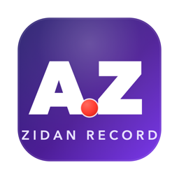

<p align="center">
  
</p>

<h1 align="center">Zidan Record</h1>

<p align="center"><b>by Abdallah Zidan</b></p>

<p align="center"><i>Windows edition — a separate development line of <a href="https://github.com/abdalaziden1111-cyber/zidan-record">zidan-record</a>, focused on a smooth Windows experience.</i></p>

<p align="center">
  
  
</p>

### Create polished demo videos in minutes

**Zidan Record** is a free, creator-focused screen recorder and editor for **walkthroughs, demos, product videos**, and more — with auto-zoom, cursor effects, styled backgrounds, annotations, webcam bubbles, captions, and denoising built in.

---

## What is Zidan Record?

Zidan Record is a desktop app for recording and editing screen captures with motion-driven presentation tools built in. Instead of sending raw footage to a motion designer just to add zooms, cursor polish, or a styled background, Zidan Record handles that workflow in one place for free.

Zidan Record runs on:

- **macOS** 14.0+
- **Windows** 10 Build 19041+
- **Linux** on modern distros

Platform notes:

- **macOS** uses native ScreenCaptureKit-based capture helpers.
- **Windows** uses a native Windows Graphics Capture (WGC) helper on supported builds, with native WASAPI audio support.
- **Linux** records through Electron capture APIs. Cursor hiding is not supported on Linux today.

---

## Core Features

- **Auto-zooms, cursor polish, and styled frames** — automatic zoom suggestions, smooth cursor movement, motion effects, wallpapers, gradients, blur, padding, and shadows.
- **Dynamic webcam bubble overlays** — position, mirror, and style a webcam bubble that reacts to zoom.
- **Timeline editing built for demos** — drag-and-drop zooms, trims, speed regions, annotations, and audio regions. Save and reopen work as `.recordly` project files.
- **Local captions** — on-device Whisper transcription, free and offline.
- **Audio denoising** — free ffmpeg-based noise reduction.
- **Extensions** — extend the editor with custom effects, sounds, device frames, and more (see [EXTENSIONS.md](EXTENSIONS.md)).

---

## Build from source

### Prerequisites

**macOS:** Xcode Command Line Tools (`xcode-select --install`).

**Linux (Ubuntu/Debian):**

```bash
sudo apt install build-essential cmake libx11-dev libxtst-dev libxrandr-dev libxt-dev
```

### Develop

```bash
npm install
npm run dev
```

### Package

```bash
npm run build        # current platform
npm run build:mac
npm run build:win
npm run build:linux
```

---

## Credits & License

Zidan Record by **Abdallah Zidan**.

This project is based on **[Recordly](https://github.com/webadderallorg/Recordly)** by @webadderall, which itself started as a fork of the **OpenScreen** project by Siddharth Vaddem. Licensed under **AGPL-3.0** — see [LICENSE.md](LICENSE.md) for the full terms and naming/attribution conditions.
